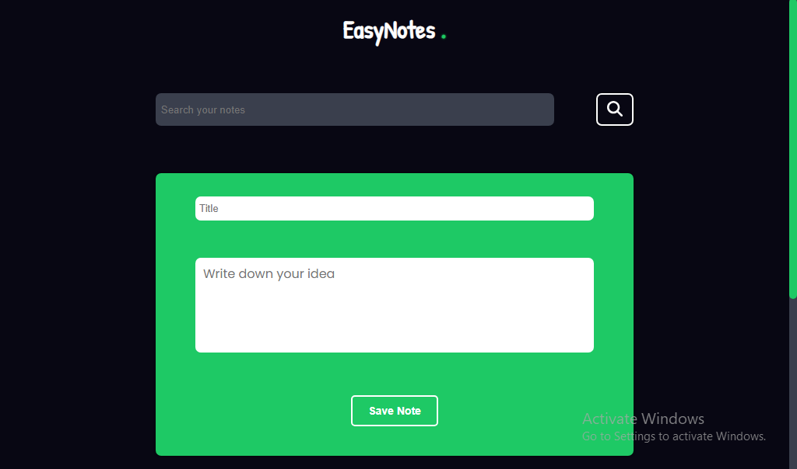

# 📝 EasyNotes

This is a beginner-friendly Note Taking Web App built using **HTML, CSS and JavaScript**. It allows users to:

- Create notes
- Edit notes
- Delete notes (with confirmation popup)
- Search notes
- Save notes using **local storage** so they persist even after refreshing the page

## 🚀 Features

- Minimal and clean UI
- Notes are stored in browser's local storage
- Smooth animations on hover and popup
- Confirmation popup before deleting a note

## 📸 Preview

 *(you can add a screeshot here)*

## 🛠️ Tech Stack

- HTML
- CSS
- JS
- LocalStorage API

## 📂 How to use

1. Clone the repository: git clone https://github.com/ronit1049/EasyNotes.git

2. Open index.html in your browser.

That's it! No need to install anything.